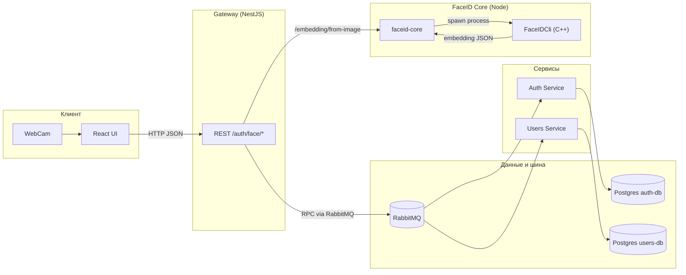
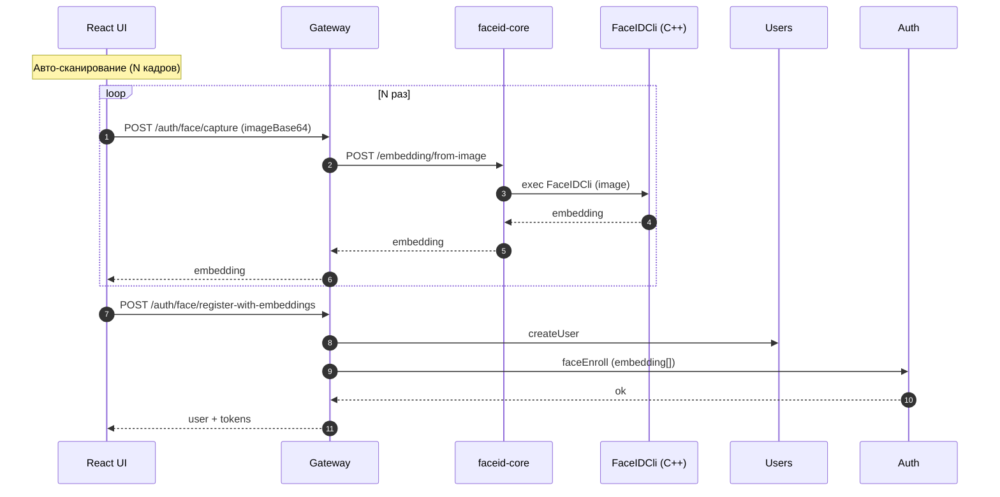
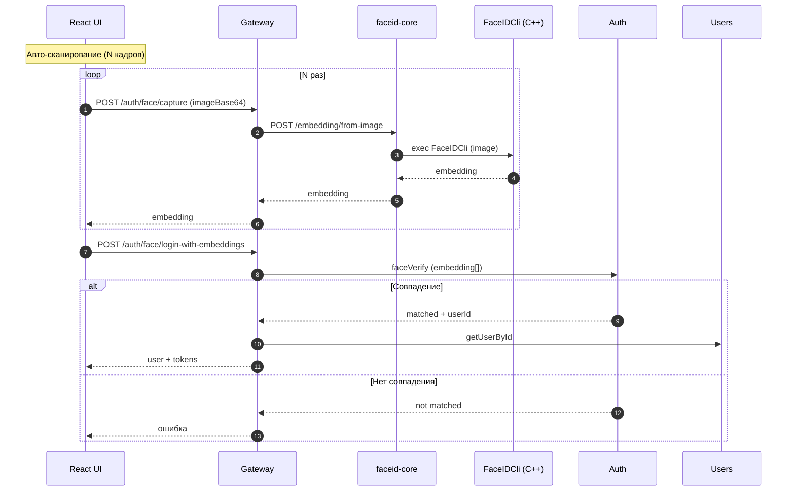
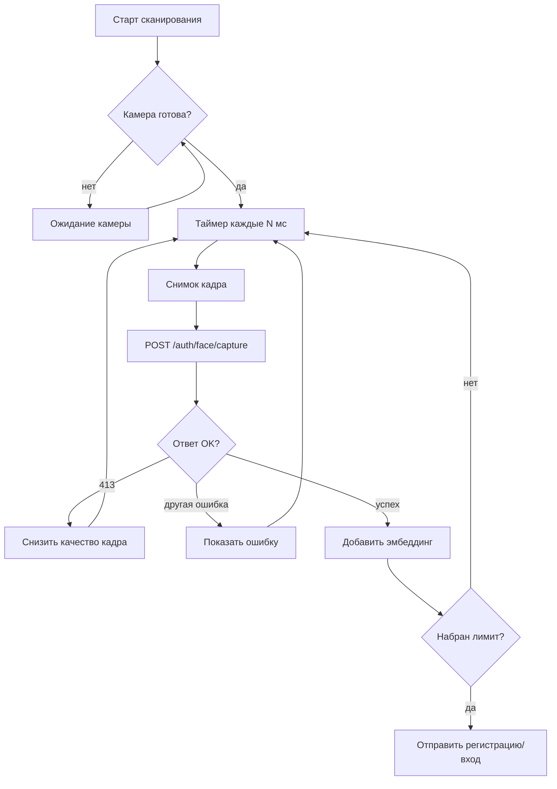

# FaceID Auth Platform (C++ + NestJS + React)

Полный стек авторизации по лицу: C++ вычисляет эмбеддинги, backend хранит шаблоны, frontend управляет сценарием регистрации и входа.

## Состав проекта

- **C++ ядро**: `src/` — FaceID приложение и CLI для получения эмбеддинга
- **faceid-core**: `faceid-core/` — HTTP сервис, который запускает C++ CLI
- **gateway**: `gateway/` — API шлюз (REST), принимает запросы от клиента
- **auth**: `auth/` — хранит face-шаблоны и выполняет проверку
- **users**: `users/` — хранит пользователей
- **client**: `client/` — React UI
- **docker-compose**: `docker-compose/` — запуск всех сервисов

## Архитектура (контуры)



## Поток регистрации



## Поток входа



## Цикл «capture» (клиент)



## Компоненты C++

- `FaceID` — GUI/камера (используется локально, не в docker)
- `FaceIDCli` — CLI, который принимает путь до изображения и возвращает JSON с эмбеддингом

Пример вывода CLI:

```json
{
  "embedding": [0.0123, 0.0456, ...]
}
```

## Docker Compose

Основной запуск: `docker-compose/docker-compose.yml`

Сервисы:
- `rabbitmq`
- `faceid-core`
- `users-db`
- `auth-db`
- `users`
- `auth`
- `gateway`
- `client`

Запуск:

```bash
docker compose -f docker-compose/docker-compose.yml up --build
```

## Основные эндпоинты

- `POST /auth/face/capture`
- `POST /auth/face/register-with-embeddings`
- `POST /auth/face/login-with-embeddings`

## Где меняется логика

- C++ CLI: `src/cli.cpp`
- Face core (HTTP): `faceid-core/server.js`
- Gateway FaceID API: `gateway/src/modules/auth/face-auth.controller.ts`
- Auth сервис: `auth/src/modules/auth/auth.service.ts`
- UI: `client/src/App.tsx`

## Примечания

- В docker контейнере **нет GUI**, поэтому используется только `FaceIDCli`.
- В случае ошибки `413 Payload Too Large` фронт автоматически снижает качество кадра.
- Точность определяется порогом `FACE_MATCH_THRESHOLD` (см. `docker-compose.yml`).
